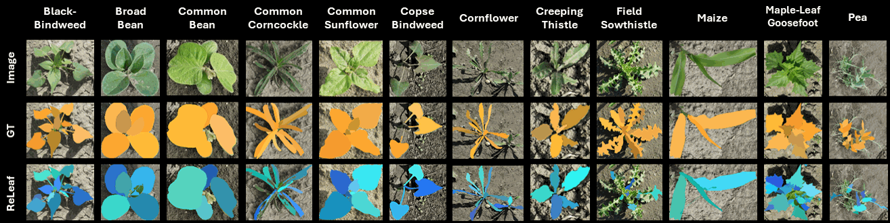

# ReLeaf



ReLeaf is a comprehensive framework for leaf segmentation providing a unified interface for training and evaluating models across multiple architectures and their variants. Its aim is to facilitate an efficient comparison of different models and configurations for leaf-level instance segmentation tasks on arbitrary input data. Our corresponding _CropAndWeedAndLeaf_ benchmark dataset for leaf segmentation is available [here](https://zenodo.org/records/20116408). For more details, refer to the [paper](https://arxiv.org/abs/2605.03784) and [poster](figure/ReLeaf-Poster.pdf) presented at the Agriculture-Vision Workshop at CVPR 2026.

## Supported Architectures

The framework is designed to be easily extensible to new variants of supported architectures. Currently, the following variants are integrated:

* __YOLO26:__ A state-of-the-art single-stage CNN architecture for real-time detection and instance segmentation. The implementation includes the _Small_, _Medium_ and _Large_ variants for instance-segmentation tasks.
* __Detectron2:__ A flexible framework for two-stage CNN detectors, supporting various backbone architectures. The implementation includes the _ResNet-50_, _ResNet-101_ and _ResNeXt_ backbones for instance segmentation.
* __RF-DETR:__ A state-of-the-art vision-transformer architecture. The implementation includes the _SegPreview_ variant for instance segmentation.

## Setup

To run any source code, clone this repository and create a python environment using:

```bash
git clone https://github.com/cropandweed/releaf.git
cd releaf

python3.12 -m venv .venv
source .venv/bin/activate
pip install -r requirements.txt
pip install --no-build-isolation 'git+https://github.com/facebookresearch/detectron2.git'
```

## Usage

The project comprises three main Python scripts for demonstrating, evaluating, and training the various models. In addition, several helper functions are housed in separate scripts. Calling the main scripts with the `-h` parameter displays detailed help information explaining all available options, including architecture identifiers applicable for the `--architecture` parameter required by all scripts.

### Demo Application

[`demo.py`](demo.py) is the central tool for generating predictions with trained models. It supports all integrated frameworks, offering configuration options for inference image sizes and confidence thresholds. The results are saved as visualizations of individual leaf masks, as well as text files containing polygons in YOLO format.

The following example command demonstrates how to run the demo with a YOLO26 model:

```bash
python demo.py --architecture yolo --model ./models/yolo26-medium/imgsz-768/train/weights/best.pth --images_dir ./data/CWL/test --image_size 768 --confidence 0.3
```

### Performance Evaluation

[`eval.py`](eval.py) is used for detailed statistical analysis of model performance. It utilizes pycocotools to calculate standard COCO metrics, but supplements them with additional performance indicators.

 __Metrics & Output__:

* __COCO mAP:__ Average precision of masks (`mask`) and bounding boxes (`bbox`) for various IoU thresholds and object sizes
* __SBD (Symmetric Best Dice):__ Average SBD value across all instances as a detailed measure of segmentation quality
* __Basic metrics:__ Precision (P), Recall (R) and the F1 score for masks and boxes
* __Performance:__ Measurement of the average inference time per image (ms/img) and images per second (FPS)

The following example command demonstrates how to run the evaluation with a Detectron2 model:

```bash
python eval.py --architecture detectron-r101 --model ./models/detectron2-resnet101/imgsz-576/model_final.pth --gt_path ./data/CWL/test/_annotations.coco.json --image_size 576 --confidence 0.3
```

### Model Training

[`train.py`](train.py) is an abstracted interface for training models across different frameworks using a uniform syntax. It supports training for YOLO26, Detectron2 and RF-DETR architectures, with configurable parameters for epochs, batch size and image sizes.

The following example command demonstrates how to train a set of YOLO26 _Small_ model on arbitrary data using different image sizes:

```bash
python train.py --architecture yolo-s --data_dir ./data --input_sizes 192 384 576 --batch 4 --epochs 50
```

## Datasets

To evaluate models on the _CropAndWeedAndLeaf_ benchmark presented in the paper, download the dataset, convert the data from YOLO to COCO format and merge labels into a single leaf category using the provided script:

```bash
cd ..
wget https://zenodo.org/records/20116408/files/CropAndWeedAndLeaf.zip
unzip CropAndWeedAndLeaf.zip -d CropAndWeedAndLeaf
cd releaf
python scripts/yolo_to_coco.py --data_dir ../CropAndWeedAndLeaf --output_dir ./data/CWL --merge_categories
```

After this step, the dataset under _./data/CWL_ can be used by the demo and evaluation scripts as described above.

Other compatible leaf-segmentation datasets used for training and evaluation in the paper, can be downloaded from their original sources: [PhenoBench](https://www.phenobench.org/dataset.html), [LSC](https://www.plant-phenotyping.org/datasets-home), [Komatsuna](https://datasetninja.com/komatsuna), [GrowliFlower](https://phenoroam.phenorob.de/geonetwork/srv/eng/catalog.search#/metadata/cb328232-31f5-4b84-a929-8e1ee551d66a)

### Data Preparation

The data structure passed to the training script depends on the architecture being trained. While YOLO26 has its own [format](https://docs.ultralytics.com/datasets/segment), both Detectron2 and RF-Detr require the data to be structured according to the COCO standard:

```text
  data/
  ├── train/
  |   ├── _annotations.coco.json
  │   ├── image_example.jpg
  │   └── ...
  ├── val/
  |   ├── _annotations.coco.json
  |   └── ...
  └── test/
      ├── _annotations.coco.json
      └── ...
```

For evaluation with [`eval.py`](eval.py), all architectures require the data to be in COCO format.

To convert annotations from YOLO format to the COCO standard, the script [`yolo_to_coco.py`](scripts/yolo_to_coco.py) is provided.

## License

This work is licensed under a [Creative Commons Attribution-NonCommercial-ShareAlike 4.0 International License](http://creativecommons.org/licenses/by-nc-sa/4.0/).

[![CC BY-NC-SA 4.0][cc-by-nc-sa-image]][cc-by-nc-sa]

[cc-by-nc-sa]: http://creativecommons.org/licenses/by-nc-sa/4.0/
[cc-by-nc-sa-image]: https://licensebuttons.net/l/by-nc-sa/4.0/88x31.png

## Citing

If you use the _ReLeaf_ framework or the _CropAndWeedAndLeaf_ dataset for your research, please use the following BibTeX entry:

```BibTeX
@InProceedings{Martinko_2026_CVPR,
    author    = {Martinko, Robert and Steininger, Daniel and Simon, Julia and Trondl, Andreas and Blaickner, Matthias},
    title     = {ReLeaf: Benchmarking Leaf Segmentation across Domains and Species},
    booktitle = {Proceedings of the IEEE/CVF Conference on Computer Vision and Pattern Recognition (CVPR) Workshops},
    month     = {June},
    year      = {2026}
}
```
